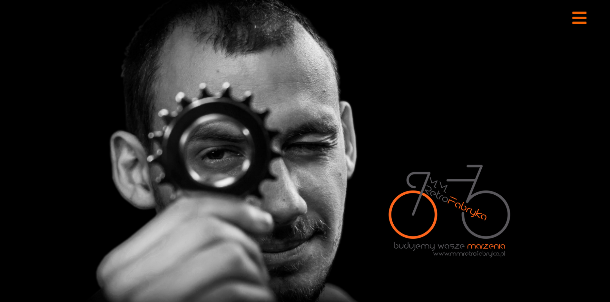
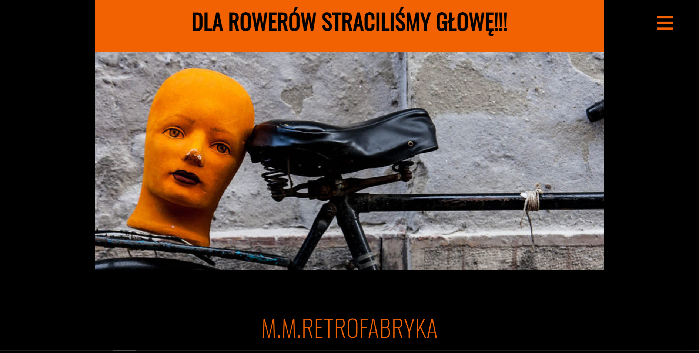
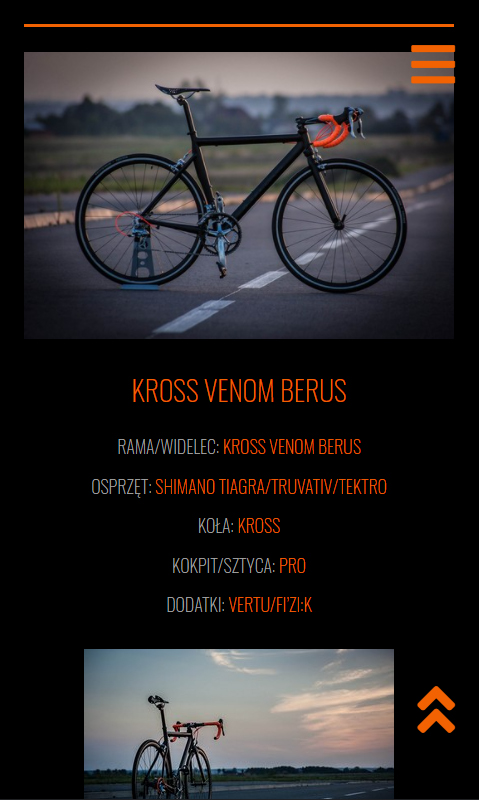

# Retrofabryka---new
> Web page for company Retrofabryka - bike service.

## Table of contents
* [Colors key](#colors-key)
* [General info](#general-info)
* [Screenshots](#screenshots)
* [Technologies](#technologies)
* [Features](#features)
* [Inspiration](#inspiration)
* [Contact](#contact)

## Colors-key

## General info

I started to create this web page on the beggining of my developer adventure. So it is not a perfect code, but I want to rebuild it soon. It is web page for my friend Mateusz, he is owner of this company - bike service and factory of custom bikes. All photos on this web opage are made by me.

## Screenshots

### Main view

### One of the sections

### Gallery on mobile view (Lightbox library)

## Technologies
* HTML
* CSS
* Javascript
* SCSS
* Lightbox library

## Features

Live demo http://www.mmretrofabryka.pl/

## Status
Project is: finished

## Inspiration
Project inspired by friend Mateusz - owner of Retrofabryka.

## Contact
Created by [przemoszadkowski@o2.pl](mailto:user@example.com) - feel free to contact me!

